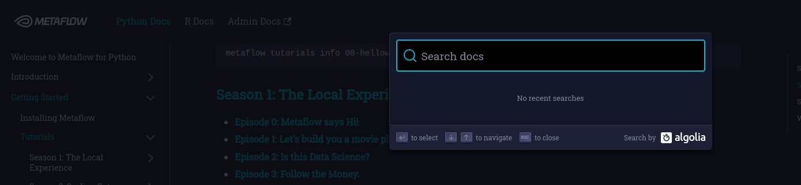

# Execution


This project use Metaflow, a framework developed by Netflix to help data science project management.

**Funny Fact:** Metaflow use Algolia for documentation search



---
**NOTE**

To know more about Metaflow, please check [the documentation](https://docs.metaflow.org/)

---

## Project Flows

This project is organised in "Flow". Each Flow is composed by one or several Steps.
These Flows are defined in a logically way defining steps of a data science project lifecyle.

> To have more details about flows composing this project please check [this page](./flows.md)


### Train Test Split

If you want to generate Train, Test and Validation sets for training


| Argument Name                      | Description                                                                               | Required | Default                             |
|--------------------------------|-------------------------------------------------------------------------------------------|----------|-------------------------------------|
| random_state                   | Secure the reproducibility of a run                                                       | False    | 42                                  |
| config_path                    | Config file path for training params                                                      | False    | user_recommendation/conf/config.yml |
| input_file_path                | Path to files containing input data                                                       | False    | data/                               |
| positive_interaction_threshold | Threshold defining if an interactions question/answer is positive based on answer's score | False    | 1                                   |

Before running the flow, you have the possibility to visualize it in your terminal in a pipeline format including explaination for each step.

Just run

```bash
source .venv/bin/activate
python user_recommendation/train_test_split_flow.py show
```


Example:

Code:
```bash
source .venv/bin/activate
python user_recommendation/train_test_split_flow.py run --positive_interaction_threshold 1
```

### Text Processing

For keywords extraction from textual data for users and questions.


| Argument Name                      | Description                                                                               | Required | Default                             |
|--------------------------------|-------------------------------------------------------------------------------------------|----------|-------------------------------------|
| random_state                   | Secure the reproducibility of a run                                                       | False    | 42                                  |
| config_path                    | Config file path for training params                                                      | False    | user_recommendation/conf/config.yml |
| input_file_path                | Path to files containing input data                                                       | False    | data/                               |


Before running the flow, you have the possibility to visualize it in your terminal in a pipeline format including explaination for each step.

Just run

```bash
source .venv/bin/activate
python user_recommendation/text_processing_flow.py show
```

Example:

Code:
```bash
source .venv/bin/activate
python user_recommendation/text_processing_flow.py run --input_file_path data/
```

### Training Model


If you want to train your model.

---
**NOTE**

Require that Train Test Split flow was run previously.

---


| Argument Name    | Description                                                                                                                                                                                                             | Required | Default                             |
|--------------|-------------------------------------------------------------------------------------------------------------------------------------------------------------------------------------------------------------------------|----------|-------------------------------------|
| random_state | Secure the reproducibility of a run                                                                                                                                                                                     | False    | 42                                  |
| config_path  | Config file path for training params                                                                                                                                                                                    | False    | user_recommendation/conf/config.yml |
| is_tracked   | Boolean defining if model performances are monitoring during the training for each epoch.  For the moment only evaluation metrics surch as AUC, precision at k and recall at k are available.NB: This is time consuming | False    | True                                |
| show_plot    | If **is_tracked=True**. Define if monitored metrics are plotted or not                                                                                                                                                  | False    | True                                |

Before running the flow, you have the possibility to visualize it in your terminal in a pipeline format including explaination for each step.

Just run

```bash
source .venv/bin/activate
python user_recommendation/training_flow.py show
```

Example:

Code:

```bash
source .venv/bin/activate
python user_recommendation/training_flow.py run --random_state 42
```
