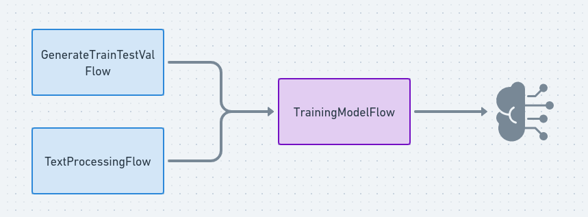

# User Recommendation Flows

## A picture is worth a thousand words

**[Not really a picture.. But click anyway](https://whimsical.com/stack-overflow-reco-A9zt7mxK1TK3RC3RMFw2C3)**

## Flows Order

Running these flows required a specific order, at least for one of them.
Again...
> *A picture is worth a thousand words*

## Stored Data Artifacts

>-But if I trained a really amazing model with your flows, how can I retrieve my model ??
>
>-Don't worry and **[Follow me](../../../user_recommendation/user_recommendation.ipynb)**

## Example of report

[Here](./images/default-fcb71634c14de0ee6fd2f465b20329b750cb9780.html) an example of report generating at the end of the training flow, this is the code source and have to be open on a browser.
